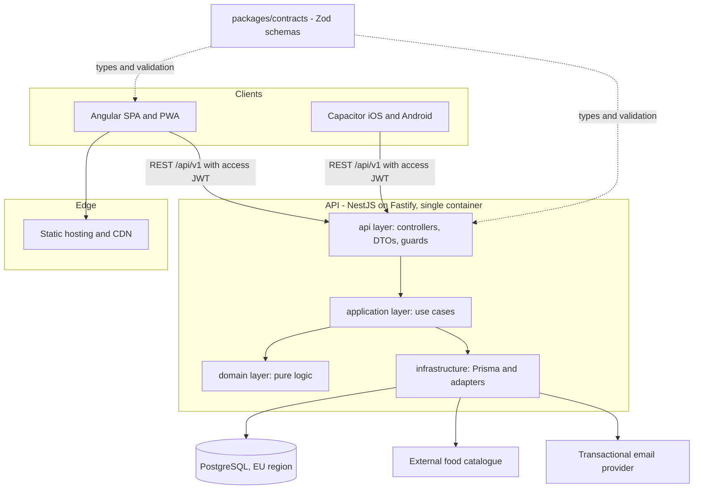
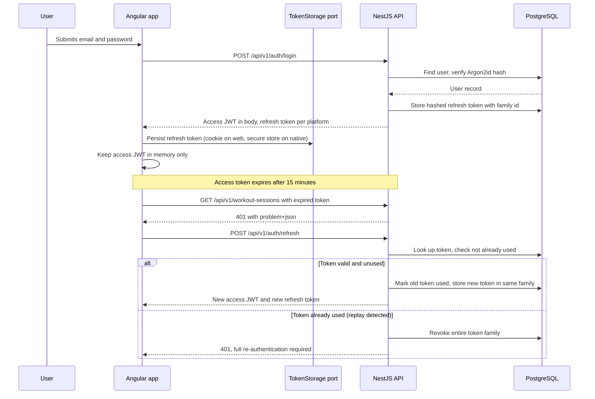
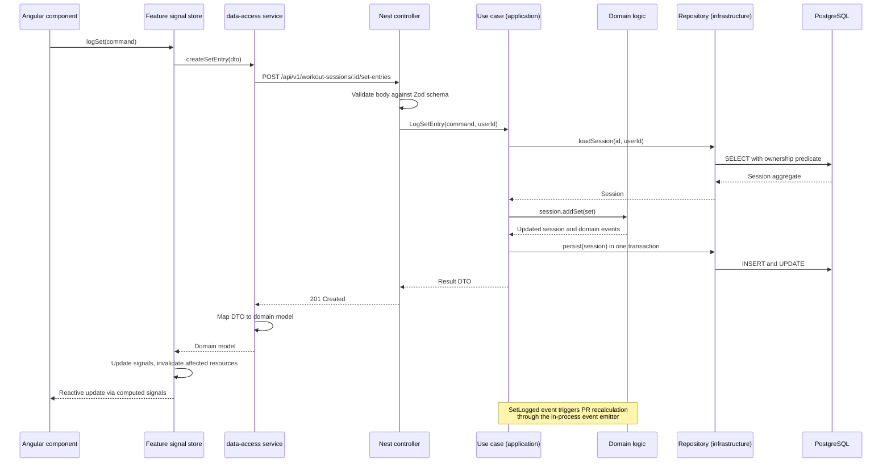
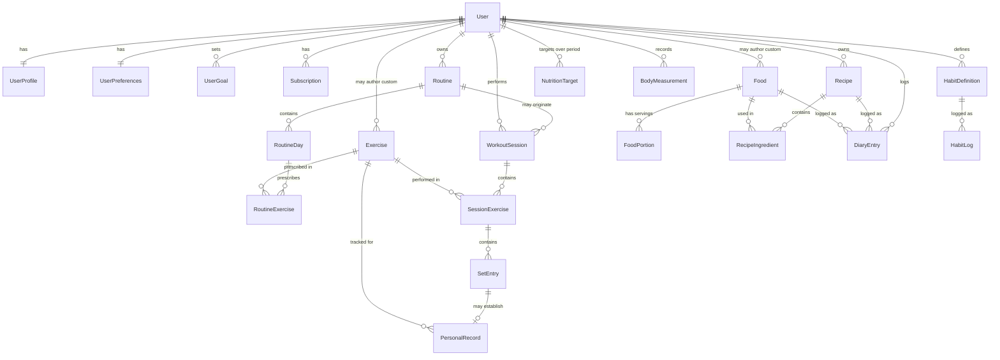

# My Fit Tracker — Technical Architecture

> Status: proposed, not yet implemented. No application code exists at the time of writing.
> Last reviewed: 2026-08-23. Target versions: Angular 22.1.x, NestJS 11.2.x, PostgreSQL 17, Node 24 LTS.

This document is the single source of architectural truth for the project. Individual decisions
are recorded as ADRs under [docs/ADR](./ADR/README.md); this document explains how they fit
together. The delivery sequence lives in [docs/ROADMAP.md](./ROADMAP.md).

---

## Table of contents

1. [Architecture summary](#1-architecture-summary)
2. [Technology decisions](#2-technology-decisions)
3. [Architecture diagrams](#3-architecture-diagrams)
4. [Repository structure](#4-repository-structure)
5. [Frontend architecture](#5-frontend-architecture)
6. [Backend architecture](#6-backend-architecture)
7. [Database](#7-database)
8. [Authentication](#8-authentication)
9. [State management](#9-state-management)
10. [API](#10-api)
11. [Testing](#11-testing)
12. [CI/CD](#12-cicd)
13. [Security](#13-security)
14. [Observability](#14-observability)
15. [Scalability](#15-scalability)
16. [Future and open decisions](#16-future-and-open-decisions)

---

## 1. Architecture summary

My Fit Tracker is a personal training and nutrition tracking application intended to become a
commercial product. The architecture is a **modular monolith on both ends**: one Angular
single-page application and one NestJS HTTP API, sharing a typed contract package, backed by a
single PostgreSQL database, developed in one repository.

Three principles drive every decision in this document:

**Optimise for change, not for scale we do not have.** The product has one developer and zero
users today. The bottleneck is the cost of changing the code, not requests per second. Therefore
we invest in module boundaries, typed contracts and tests, and we explicitly reject
microservices, Kubernetes, event sourcing, CQRS and message brokers until a measured need exists.

**Layer where the complexity is.** A CRUD module that stores a body measurement does not need
four layers. Training progression, personal-record detection and nutrition aggregation do. The
architecture applies full layering selectively rather than uniformly, because uniform layering on
trivial modules produces indirection without insight.

**Make boundaries executable.** A rule that only lives in a document decays. Import boundaries
are enforced by ESLint, contracts by Zod schemas validated at runtime, and architectural rules by
[.cursor/rules/architecture.mdc](../.cursor/rules/architecture.mdc).

### What the system does

- Records **workout sessions**: exercises, sets, reps, weight, duration, rest, RIR/RPE.
- Records **nutrition**: foods, recipes, meals, calories, macronutrients, daily targets.
- Records **body progress**: weight, measurements, personal records.
- Records **habits** related to training and nutrition.
- Derives **statistics and progression** from the above.

### Current state of the repository

At the time of writing the repository contains only `.gitignore`, `LICENSE` and `README.md`.
There is no `package.json`, no Angular workspace and no backend. Everything in this document is
greenfield, which means there is no migration cost and no architectural debt to unwind — only the
`.gitignore`, which was written for a single Angular project at the repository root and is
corrected as part of this work.

---

## 2. Technology decisions

Every entry links to the ADR containing the full alternatives comparison, trade-offs and
consequences. The table is a summary, not the justification.

| Concern | Choice | ADR |
| --- | --- | --- |
| Repository layout | Single repo, npm workspaces, no Nx | [ADR-006](./ADR/ADR-006-monorepo-and-tooling.md) |
| Frontend framework | Angular 22, standalone, signals-first | [ADR-001](./ADR/ADR-001-frontend-framework-and-ui.md) |
| UI layer | Tailwind CSS + Angular CDK, no Material | [ADR-001](./ADR/ADR-001-frontend-framework-and-ui.md) |
| Forms | Signal Forms with shared Zod schemas | [ADR-001](./ADR/ADR-001-frontend-framework-and-ui.md) |
| Backend framework | NestJS 11 + Fastify adapter | [ADR-002](./ADR/ADR-002-backend-framework.md) |
| API style | REST, URI-versioned, RFC 9457 errors | [ADR-003](./ADR/ADR-003-api-style.md) |
| Database | PostgreSQL | [ADR-004](./ADR/ADR-004-database-and-orm.md) |
| ORM | Prisma, with raw SQL escape hatch | [ADR-004](./ADR/ADR-004-database-and-orm.md) |
| Frontend state | Signals + feature stores, no NgRx | [ADR-005](./ADR/ADR-005-state-management.md) |
| Shared contract | `packages/contracts` with Zod | [ADR-007](./ADR/ADR-007-shared-contracts.md) |
| Authentication | Self-hosted JWT + rotating refresh tokens | [ADR-008](./ADR/ADR-008-authentication.md) |
| Authorization | Role + entitlement + quota, separated | [ADR-009](./ADR/ADR-009-authorization-and-entitlements.md) |
| Mobile & offline | Capacitor, PWA with a workout outbox | [ADR-010](./ADR/ADR-010-mobile-and-offline-strategy.md) |
| Food data | Provider port, external catalogue | [ADR-011](./ADR/ADR-011-nutrition-data-source.md) |
| Testing | Vitest, Testcontainers, Playwright | [ADR-012](./ADR/ADR-012-testing-strategy.md) |
| Hosting | Static CDN + container API + managed Postgres | [ADR-013](./ADR/ADR-013-hosting-and-deployment.md) |
| Domain conventions | SI units, local dates, historical snapshots | [ADR-014](./ADR/ADR-014-domain-model-conventions.md) |

### Explicitly rejected

These are recorded so they are not silently reintroduced later:

- **GraphQL** — one client, well-known access patterns. Revisit only if third-party API consumers appear.
- **NgRx Store** — its value is action auditing and large-team coordination; neither applies.
- **MongoDB** — the domain is highly relational and statistics need SQL window functions.
- **Server-side rendering** — the application lives behind a login, so SEO value is near zero.
- **Microservices, Kubernetes, message brokers, CQRS, event sourcing** — no scaling or auditing requirement justifies their operational cost.
- **A payments integration** — the architecture prepares for it; the implementation waits for a validated product.

---

## 3. Architecture diagrams

### 3.1 System overview



The dotted lines matter: the contract package is a build-time dependency of both sides, which is
the mechanism that keeps frontend and backend from drifting apart. See
[ADR-007](./ADR/ADR-007-shared-contracts.md).

### 3.2 Authentication flow

Login and refresh-token rotation. The storage target for the refresh token differs by platform,
which is a direct consequence of shipping a Capacitor build — see
[section 8](#8-authentication).



Refresh tokens are rotated on every use and stored hashed. Reuse of an already-consumed token is
treated as theft and revokes the whole family, which is what makes rotation worth implementing at
all. Access tokens are never persisted to disk.

### 3.3 Request flow through the layers

A write that carries real domain logic: logging a set, which may produce a personal record.



Two things to note. Ownership is enforced in the query predicate, not by fetching and then
checking, which prevents a whole class of authorization bug. And the domain layer never touches
Prisma; it receives and returns plain objects, which is what makes it testable without a database.

### 3.4 Core domain relationships

Conceptual model only. No tables are created at this stage; see
[section 7](#7-database) for the reasoning behind the shape.



The single most important relationship in this diagram is the separation of `Routine`
(what was planned) from `WorkoutSession` (what actually happened). Collapsing them is the most
common modelling mistake in fitness applications and it is unrecoverable once there is user data.

---

## 4. Repository structure

```
my-fit-track/
├── apps/
│   ├── web/                       Angular 22 SPA, later wrapped by Capacitor
│   └── api/                       NestJS 11 HTTP API on Fastify
├── packages/
│   ├── contracts/                 Zod schemas and inferred types shared by web and api
│   └── config/                    Shared ESLint, Prettier and tsconfig bases
├── docs/
│   ├── ARCHITECTURE.md            This document
│   ├── ROADMAP.md                 Delivery phases and MVP scope
│   └── ADR/                       Architecture Decision Records
├── .cursor/rules/                 Executable architectural rules for AI-assisted work
├── .github/workflows/             CI pipelines
├── docker-compose.yml             Local PostgreSQL for development
├── package.json                   npm workspaces root, task scripts
└── package-lock.json              Committed; required for reproducible builds
```

### Responsibility of each top-level folder

**`apps/`** holds deployable units. Nothing in `apps/` may be imported by another app. If two
apps need the same code, it moves to `packages/`. This is what keeps the boundary honest.

**`packages/contracts/`** is the only place where the shape of the HTTP API is defined. It has no
runtime dependency on Angular or NestJS — only Zod — so both sides can depend on it without
pulling in the other's framework.

**`packages/config/`** holds shared tool configuration. It exists to prevent three divergent
ESLint setups, not as a general utility dump. Runtime code does not belong here.

**`docs/`** holds durable explanation. ADRs are append-only: a superseded decision is marked
superseded rather than edited, because the reasoning behind a past choice is what makes a future
reversal safe.

**`.cursor/rules/`** encodes the architectural rules from section 21 of the original brief so they
are applied during development rather than rediscovered in review.

### Frontend internal structure

```
apps/web/src/
├── app/
│   ├── core/                      Cross-cutting, instantiated once, no feature knowledge
│   │   ├── auth/                  Session service, token storage port and adapters, guards
│   │   ├── http/                  Interceptors: auth header, refresh, error mapping, retry
│   │   ├── error/                 Global error handler, typed AppError, user-facing mapping
│   │   ├── config/                Environment and runtime configuration
│   │   └── platform/              Platform detection, native adapters, storage abstractions
│   ├── shared/                    Reusable and domain-free: UI primitives, pipes, utilities
│   ├── layout/                    Application shell, navigation, page containers
│   ├── features/                  Vertical slices; the bulk of the application
│   │   ├── auth/
│   │   ├── dashboard/
│   │   ├── exercises/
│   │   ├── routines/
│   │   ├── sessions/              Live workout logging and session history
│   │   ├── nutrition/             Foods, recipes, diary, targets
│   │   ├── progress/              Weight, measurements, personal records, charts
│   │   ├── habits/
│   │   ├── profile/
│   │   └── settings/
│   ├── app.routes.ts              Top-level lazy route definitions
│   └── app.config.ts              Application providers
├── styles/                        Tailwind entry point and design tokens
└── main.ts
```

Every feature follows the same internal shape, so that navigating an unfamiliar feature requires
no exploration:

```
features/<feature>/
├── data-access/                   HTTP services and DTO-to-domain mappers
├── state/                         Signal store(s) for this feature
├── domain/                        Pure models and business rules used by the UI
├── ui/                            Presentational components, no data fetching
├── pages/                         Routed components that compose ui + state
└── <feature>.routes.ts            Lazy routes owned by the feature
```

### Enforced import rules

These are checked by ESLint (`eslint-plugin-boundaries` or `import/no-restricted-paths`), not by
convention:

- A feature must not import from another feature. Shared code moves to `shared/`; shared behaviour
  moves to `core/`; cross-feature interaction happens through routing or a `core` service.
- `core/` and `shared/` must not import from `features/`. A dependency in that direction means the
  code is not actually cross-cutting.
- `ui/` must not import from `data-access/`. Presentational components receive inputs and emit
  outputs; this is what makes them testable and reusable.
- `domain/` must not import from `data-access/`, `infrastructure/` or any framework module.
- On the API side, `domain/` must not import from `infrastructure/`, and `infrastructure/` must not
  be imported by controllers directly.

The reason to automate these rather than trust review: they are exactly the rules that erode under
time pressure, and a circular feature dependency is far cheaper to prevent than to untangle.

---

## 5. Frontend architecture

### Framework baseline

Angular 22 with standalone components throughout — no `NgModule` outside of third-party interop.
Angular 22 changed two defaults that matter here: `OnPush` is now the default change detection
strategy, and `resource`/`rxResource`/`httpResource` are stable. Both align with a signals-first
design, so we take the defaults rather than fight them. TypeScript 6 is required by Angular 22.

Zoneless change detection is the target configuration. It removes `zone.js` from the bundle and
makes rendering driven purely by signals, which is only viable because we are not carrying legacy
promise-based state. If a third-party dependency turns out to require zones, this is a one-line
revert, so it is a low-risk default rather than a commitment.

### UI layer

**Tailwind CSS for styling, Angular CDK for behaviour, no Angular Material.** The application is
mostly dense data-entry forms used one-handed in a gym, plus data visualisation. Material's value
is a complete opinionated component set; its cost is a recognisable visual identity that is hard
to differentiate commercially and a non-trivial bundle. The CDK gives us the parts that are
genuinely hard to build correctly — overlays, focus management, accessibility primitives, virtual
scrolling, drag and drop — without imposing appearance.

The trade-off is real: we build our own buttons, inputs, dialogs and date pickers. That is
accepted because the component surface of this product is small and the visual identity is part of
the product. See [ADR-001](./ADR/ADR-001-frontend-framework-and-ui.md).

### Forms

**Signal Forms**, using the same Zod schemas that `packages/contracts` exports, via standard-schema
validation. This removes the most common source of duplicated logic in this kind of application:
validation rules written once for the client and again for the server.

This is the newest technology in the stack — Signal Forms became stable in Angular 22 in June 2026
— and therefore the highest-risk choice in this document. The mitigation is that Reactive Forms
remain fully supported with documented interop in both directions, so a retreat is per-form, not
architectural.

### Error handling

A single pipeline, so that no component invents its own:

1. An HTTP interceptor catches failures and maps RFC 9457 `problem+json` responses into a typed
   `AppError` with a stable `code`, a user-safe message and the original field errors.
2. `401` triggers exactly one refresh attempt, with concurrent requests queued behind it. A second
   failure clears the session and routes to login.
3. Expected domain errors (`409` conflict, `422` validation) are returned to the calling store,
   which surfaces them in the UI. They are not logged as incidents.
4. Unexpected errors reach a global `ErrorHandler`, which shows a non-blocking notification and, in
   production, reports to the error tracker.
5. Route-level error boundaries prevent one failing widget from blanking a whole page.

The rule that keeps this useful: components display errors, they do not interpret transport-level
failures.

### Routing

Every feature is lazy-loaded through `loadChildren` pointing at the feature's own routes file, so
the feature owns its URL space. Guards are functional (`CanActivateFn`). Authentication and
entitlement guards are declarative and, critically, treated as user-experience only — the API is
the sole authority on access (see [section 13](#13-security)).

---

## 6. Backend architecture

### Framework

NestJS 11 on the Fastify adapter. The reasoning, in short: we need dependency injection, a module
system that maps to bounded contexts, and validation, guards and interceptors at the request
boundary. NestJS provides all of it and mirrors Angular's mental model, which for a single
developer working on both sides is a genuine productivity property rather than an aesthetic one.
Express would mean reimplementing the same structure by hand. Fastify over Express for throughput
and a cleaner plugin model, accepting that Express-specific recipes do not apply.

Note for deployment: Nest's decorator metadata and module graph make cold starts meaningful, so the
API is deployed as a long-lived container, not as a per-request serverless function. See
[ADR-002](./ADR/ADR-002-backend-framework.md) and
[ADR-013](./ADR/ADR-013-hosting-and-deployment.md).

### Module layout

```
apps/api/src/
├── modules/
│   ├── auth/                      Login, refresh, password reset, later OIDC
│   ├── users/                     Identity, profile, preferences, goals, GDPR export/delete
│   ├── exercises/                 Exercise catalogue, global and user-authored
│   ├── routines/                  Training plans (prescription)
│   ├── sessions/                  Performed workouts, set entries (execution)
│   ├── nutrition/                 Foods, recipes, diary entries, targets
│   ├── progress/                  Measurements, personal records, derived statistics
│   ├── habits/
│   └── billing/                   Plans and entitlements; no payment provider yet
├── common/                        Filters, guards, interceptors, pipes, decorators
├── infrastructure/
│   ├── prisma/                    Client, transactions, migrations access
│   ├── config/                    Typed, validated configuration
│   ├── logging/                   Structured logger, request correlation
│   ├── mail/                      Transactional email adapter
│   └── food-catalogue/            External provider adapters
└── main.ts
```

### Layering, applied selectively

This is where the architecture deliberately deviates from a uniform template.

**Simple modules** — `habits`, `progress` measurements, `users` profile — use
`controller → service → Prisma`. Adding an application layer, a domain entity and a repository
interface to a module whose logic is "store this row for this user" produces four files that all
say the same thing. That is indirection without insight.

**Modules with real logic** — `sessions` (progression, volume, PR detection), `nutrition`
(aggregation, portion maths, target evaluation), `auth` (token lifecycle) — use the full stack:

```
modules/<context>/
├── api/                Controllers, request/response DTOs, module wiring
├── application/        Use cases: orchestration, transactions, authorization checks
├── domain/             Entities, value objects, invariants, pure calculations
└── infrastructure/     Prisma repositories, external adapters
```

The dependency rule is one-directional: `api → application → domain`, with `infrastructure`
injected into `application` through interfaces declared in `domain`. The domain layer imports
nothing from Nest, Prisma or HTTP.

**Ports exist only where there is a second implementation or a real seam**, specifically:
`FoodCatalogueProvider` (external data source, deliberately swappable — see
[ADR-011](./ADR/ADR-011-nutrition-data-source.md)), `TokenStorage` on the client, `IdentityProvider`
(so a managed identity provider can replace self-hosted auth without touching the domain), and
`MailSender`. Wrapping Prisma in a repository interface for a module that has no domain logic buys
nothing and is not done.

### Cross-context communication

When completing a session must trigger personal-record recalculation, the `sessions` module emits
an in-process domain event (`@nestjs/event-emitter`) that `progress` handles. This is a deliberate
middle ground: it prevents `sessions` from importing `progress` internals, without introducing a
message broker, delivery guarantees or a second deployable. If a handler ever needs to survive a
crash or run on a schedule, it graduates to a queue at that point — and that is a contained change
because the emitting side already publishes an event rather than calling a service.

---

## 7. Database

### Choice: PostgreSQL

The domain is a set of ownership hierarchies with hard integrity requirements: a set entry belongs
to a session exercise, which belongs to a session, which belongs to a user. Losing that integrity
corrupts a training history that cannot be reconstructed. On top of that, the interesting product
features are analytical: estimated one-rep-max progression, weekly volume per muscle group,
adherence rates, personal-record detection. Those are window functions and grouped aggregates —
SQL's home ground.

MongoDB was evaluated and rejected. Its schema flexibility solves a problem we do not have (the
schema is well understood), while its costs are exactly where this domain lives: joins move into
application code, referential integrity becomes our responsibility, and analytics require either
an aggregation pipeline or a second system. `JSONB` covers the genuinely semi-structured parts —
cached external food payloads, user preferences, feature flags — without giving up relational
guarantees. See [ADR-004](./ADR/ADR-004-database-and-orm.md).

### ORM: Prisma

Prisma gives typed queries, a solid migration workflow and a schema that is readable as
documentation. Its weakness is complex analytical SQL, which is precisely what the statistics
features need — so the pattern is: Prisma for all transactional access, `$queryRaw` with explicit
typing for analytical read models, isolated inside repository classes. Drizzle is the documented
alternative if the raw-SQL surface grows beyond a handful of queries.

### Conventions that prevent known bug classes

These are the modelling rules that matter more than the exact column list. Each one exists because
violating it produces a bug that is expensive to fix after launch. Full reasoning in
[ADR-014](./ADR/ADR-014-domain-model-conventions.md).

**Prescription is separate from execution.** `Routine`, `RoutineDay` and `RoutineExercise` describe
a plan. `WorkoutSession`, `SessionExercise` and `SetEntry` describe what happened. A session may
reference the routine it came from, but it never depends on it: editing next month's plan must not
rewrite last month's history.

**History stores snapshots, not just references.** A `DiaryEntry` records the computed calories and
macros at the moment of logging, alongside the food reference. External food data gets corrected
and user-authored foods get edited; a diary that silently rewrites the past is worse than useless
for someone tracking a cut. The same applies to a `SetEntry` and the exercise definition it used.

**Units are canonical in storage, localised in presentation.** Grams, kilograms, metres, seconds.
The user's kg/lb preference is a display concern stored on `UserPreferences`. Storing pounds
because the user prefers pounds guarantees a rounding-drift bug in aggregates.

**A workout date is a local calendar date, not a timestamp.** `DATE` plus the user's timezone. With
a UTC timestamp, a meal logged at 23:30 lands on the wrong day for half the world, and every daily
total becomes subtly wrong.

**Deletion has two meanings.** Soft delete for user-visible history, so an accidental tap is
recoverable. Hard, irreversible delete for GDPR erasure requests, which soft delete does not
satisfy.

**Derived data is computed on read until measured otherwise.** Personal records and weekly volume
start as indexed queries. Materialised views or cache tables are added when a query is measurably
slow, not in anticipation.

**Every user-owned table carries `user_id` and every query filters on it.** Tenant isolation is
enforced in the query predicate at the repository layer, so a missing check fails to return data
rather than returning someone else's.

### Local development

`docker-compose.yml` provides PostgreSQL only. The API and the web app run natively via npm
scripts, because containerising the developer's own edit-reload loop adds latency without
protecting anything. Migrations are Prisma migrations, committed, applied in CI and never edited
after being merged.

---

## 8. Authentication

### Strategy

Self-hosted authentication in the `auth` module, designed so that a managed identity provider can
replace it without touching the domain. Email and password first; Google and Apple sign-in added
later through OAuth 2.0 Authorization Code with PKCE, behind the same `IdentityProvider` port.

The risk is stated plainly: hand-rolled authentication is the single most common source of serious
security defects in solo-developer products. It is chosen here because user identity is
inseparable from the domain data of a product intended for sale, and because the per-user cost of a
hosted provider compounds. It is mitigated by using vetted libraries rather than custom
cryptography (Argon2id for password hashing, Passport for flow plumbing), by keeping the provider
behind a port, and by treating the token lifecycle rules below as non-negotiable. See
[ADR-008](./ADR/ADR-008-authentication.md).

### Token design

- **Access token**: JWT, 15-minute lifetime, contains `sub`, `role`, entitlement claims and
  `jti`. Sent as `Authorization: Bearer`. Never written to disk — memory only, in a service, not in
  `localStorage` or `sessionStorage`, because anything readable by JavaScript is readable by an XSS
  payload.
- **Refresh token**: opaque random value, 30-day lifetime, stored **hashed** server-side with a
  family identifier. Rotated on every use. Reuse of a consumed token revokes the entire family and
  forces re-authentication. Server-side storage is what makes revocation, "log out everywhere" and
  a device list possible at all.

### Platform-dependent storage — the consequence of shipping Capacitor

This is the part that a generic "use HttpOnly cookies" answer gets wrong.

On the **web**, the refresh token is delivered as an `HttpOnly; Secure; SameSite=Strict; Path=/api/v1/auth`
cookie. It is unreadable by JavaScript, scoped to the only endpoint that needs it, and `SameSite=Strict`
neutralises cross-site request forgery for the refresh call itself.

In a **Capacitor** build the page origin is `capacitor://localhost` (iOS) or `https://localhost`
(Android), while the API lives on a real domain. That makes the cookie cross-site, and modern
platform cookie policies make cross-site cookies in an embedded WebView unreliable — depending on
the OS version they may be silently dropped. Relying on cookies there would produce an
intermittently broken login on mobile, which is exactly the kind of defect that is discovered late.

Therefore the client defines a `TokenStorage` port with two adapters, selected at bootstrap by
platform:

| Platform | Refresh token location | Access token |
| --- | --- | --- |
| Browser | `HttpOnly` cookie, set and read only by the server | In memory |
| Capacitor | OS secure storage: iOS Keychain, Android Keystore | In memory |

`@capacitor/preferences` is explicitly **not** acceptable for tokens — it is unencrypted
`UserDefaults`/`SharedPreferences`. A dedicated secure-storage plugin is required.

The API accepts the refresh token from either the cookie or an explicit request body field, and the
choice of transport is a client concern. Designing this seam now costs one interface; discovering
it after the mobile app ships costs an authentication rewrite. See
[ADR-010](./ADR/ADR-010-mobile-and-offline-strategy.md).

---

## 9. State management

### Choice: signals and feature stores, no NgRx

NgRx Store's real value is a strictly auditable action log and a shared convention for large teams.
Neither applies to a single developer, and both cost boilerplate on every interaction. Signals plus
a small store class per feature give the same testability — a store is a plain class with signals,
instantiated directly in a test with no framework harness.

For server data we use Angular 22's stable `httpResource`/`resource`, which already solve loading
and error status, dependent re-fetching when a signal changes, and cancellation of superseded
requests. Hand-writing that is where custom state layers usually rot.

The reversal trigger is explicit: if invalidating cached server state across features becomes
manual and error-prone, adopt TanStack Query for Angular — not NgRx Store, because the problem in
that scenario is cache coordination, not action auditing. See
[ADR-005](./ADR/ADR-005-state-management.md).

### The four kinds of state, and where each lives

Conflating these is what produces duplicated, drifting state.

**Server state** — data owned by the backend. Lives in the feature's `state/` store, fetched
through `data-access/`, held as `httpResource` or signals derived from it. It is a *cache*, and it
is treated as one: it has an owner, an invalidation path and no second copy elsewhere. When a
mutation succeeds, the store invalidates the affected resources rather than patching a local array
by hand — hand-patching is how a list and its detail view start disagreeing.

**Client state** — purely presentational: expanded panels, selected tab, dialog visibility, filter
inputs before submission. Lives in `signal()` fields on the component that owns it. It is promoted
to a store only when a second component genuinely needs it, never pre-emptively.

**Session state** — the authenticated user, role, entitlements, access token. Lives in exactly one
place, `core/auth`, exposed as read-only signals. Every consumer reads from it; nobody copies it
into a feature store, because two sources of truth for "who is logged in" is a security bug waiting
to happen.

**Domain state** — derived values with product meaning: today's remaining macros, current weekly
volume, whether a set is a new record. This is *always* `computed()` over server state, never
stored. Storing a derived total guarantees it will eventually disagree with the data it came from.

### Signals, RxJS and effects — when to use which

The rule, stated so that it can be applied without judgement calls:

**Signals** for synchronous state and everything derived from it. Component state, store state,
template bindings, `computed()` for derivation. This is the default; if a signal works, use a
signal.

**RxJS** only for things that are genuinely streams over time: debounced search input, server-sent
events or websockets, retry with backoff, and flows needing `switchMap`-style cancellation
semantics beyond what a resource provides. Convert at the boundary with `toSignal` and
`toObservable`, and never hold the same truth in both a signal and a subject.

**`computed()`** for any value that is a function of other state. If you find yourself writing an
`effect` that sets a signal, it should have been a `computed`.

**`effect()`** only for side effects that leave the reactive graph: persisting a preference to
storage, sending an analytics event, driving an imperative chart or map library, synchronising the
document title. Never for propagating state between signals, and never for triggering HTTP requests
— those belong to `resource` or to an explicit user-initiated action, because an effect that fetches
is an effect whose firing you cannot reason about.

---

## 10. API

### Style

REST over HTTP, JSON, versioned in the URI as `/api/v1`. URI versioning over header negotiation
because it is visible in logs, trivially cacheable and unambiguous when debugging a mobile client
in the wild. See [ADR-003](./ADR/ADR-003-api-style.md).

### Resource naming — the most consequential API decision here

The domain has four distinct concepts that a naive `/workouts` endpoint would blur together:

| Resource | Meaning |
| --- | --- |
| `/exercises` | The catalogue: an exercise definition, global or user-authored |
| `/routines` | A training plan: prescription, what the user intends to do |
| `/workout-sessions` | A performed workout: what actually happened, with a date |
| `/set-entries` | An individual logged set inside a session |

`/workouts` is rejected as a resource name because it means "plan" to one reader and "performed
session" to another, and that ambiguity migrates from the URL into the data model.

Nesting follows real ownership and stops at two levels:

```
GET    /api/v1/workout-sessions
POST   /api/v1/workout-sessions
GET    /api/v1/workout-sessions/{id}
PATCH  /api/v1/workout-sessions/{id}
DELETE /api/v1/workout-sessions/{id}
POST   /api/v1/workout-sessions/{id}/set-entries
PATCH  /api/v1/set-entries/{id}
```

Once a resource has its own identifier, it is addressed at the top level rather than through its
full ancestry. Deep nesting encodes a hierarchy in the URL that the client then has to reconstruct.

A small number of purpose-built read endpoints exist for composed views — for example
`GET /api/v1/dashboard/summary` and `GET /api/v1/progress/exercises/{id}/history`. These are the
answer to over-fetching that would otherwise be an argument for GraphQL, and they are added on
demand rather than speculatively.

### Conventions

**Response shape.** A single resource is returned as itself, unwrapped. Collections are wrapped
because they carry pagination metadata:

```json
{
  "data": [],
  "pageInfo": { "nextCursor": "…", "hasNextPage": true, "limit": 25 }
}
```

Wrapping single resources in `{ "data": … }` buys consistency at the cost of an unwrap on every
call site; the pagination metadata is a real payload difference, so the asymmetry is intentional.

**Pagination.** Cursor-based (`?cursor=&limit=`) for anything time-ordered and unbounded: session
history, diary entries, measurements. Offset pagination degrades on deep pages and, worse, skips
or duplicates rows when items are inserted while the user pages — which is guaranteed here, since
users add entries constantly. Offset pagination is allowed only for small, bounded, admin-facing
lists.

**Filtering and sorting.** Explicit allow-lists per endpoint: `?from=&to=&exerciseId=` and
`?sort=performedAt:desc`. Never a generic query language that maps user input onto database
columns — that is an injection surface and an accidental public contract.

**Status codes.** `200` read and update, `201` with `Location` on create, `204` on delete,
`400` malformed, `401` unauthenticated, `403` authenticated but not permitted, `404` absent or not
visible to this user, `409` state conflict, `422` semantic validation failure, `429` rate limited,
`5xx` server fault. `404` is deliberately returned instead of `403` for resources owned by another
user, so the API does not confirm their existence.

**Errors.** RFC 9457 Problem Details, `Content-Type: application/problem+json`, produced by one
Nest exception filter and consumed by one Angular interceptor:

```json
{
  "type": "https://api.myfittracker.app/problems/validation-error",
  "title": "Validation failed",
  "status": 422,
  "detail": "One or more fields are invalid.",
  "instance": "/api/v1/workout-sessions",
  "code": "VALIDATION_ERROR",
  "traceId": "01J9…",
  "errors": [{ "field": "sets[0].weightKg", "message": "must be greater than 0" }]
}
```

A stable machine-readable `code` is included alongside the RFC fields because clients should branch
on a code, not parse prose. `traceId` ties the response to server logs.

**Idempotency.** Mutating requests accept an `Idempotency-Key` header; the server stores the key
with its response for 24 hours and replays it on retry. This is not optional polish — it is what
makes the offline workout outbox safe
([ADR-010](./ADR/ADR-010-mobile-and-offline-strategy.md)). Without it, a retry after a timeout
silently duplicates logged sets.

**Validation.** Every request body, query and path parameter is parsed by the Zod schema from
`packages/contracts` at the controller boundary, with unknown properties rejected rather than
stripped. Nothing downstream re-validates; everything downstream can assume validity.

---

## 11. Testing

The strategy is shaped by one constraint: a single developer cannot maintain a large, slow suite.
So the goal is a small number of tests that fail for real reasons. See
[ADR-012](./ADR/ADR-012-testing-strategy.md).

### Tooling

**Vitest** as the only unit-test runner, in both apps and in `packages/contracts`. Karma is
deprecated and Vitest is the Angular CLI default for new projects, so this is the supported path
rather than a preference. One runner across the repository means one configuration, one reporter
and one coverage format.

**Angular TestBed with Testing Library** for components, asserting on rendered output and user
interaction rather than component internals. `HttpTestingController` for `data-access` services.

**Testcontainers with a real PostgreSQL** for repository and controller tests. Mocking Prisma is
explicitly rejected: a test that asserts "we called `prisma.setEntry.create` with these arguments"
passes when the query is wrong, the constraint is missing and the migration is broken. Real
Postgres in a container is slower and tests something.

**Playwright** for end-to-end, over Cypress, for parallel execution, trace-based debugging and
multi-browser coverage — the latter mattering because a Capacitor WebView is closer to Safari than
to Chrome.

### What gets tested where

**Unit tests** cover the layers with logic: domain entities and calculations (progression,
estimated one-rep-max, macro aggregation, target evaluation), Zod contract schemas, mappers, and
signal stores. These are pure and fast, and they are where coverage is expected to be high.

**Integration tests** cover the seams: NestJS controllers through to a real database, exercising
authorization, validation, transactions and constraints together. This tier catches the majority of
real defects in a CRUD-heavy application and is where the effort is concentrated.

**End-to-end tests** cover a deliberately tiny set of journeys that must never break: register and
log in, log a workout session with sets, log a meal, view progress. Every additional E2E test is a
recurring maintenance cost, so the suite is kept small on purpose and everything else is pushed
down to integration tests.

### Coverage policy

No global percentage gate initially. A repository-wide threshold on a young codebase produces
tests written to raise a number. Instead: `packages/contracts` and the `domain/` and
`application/` directories are expected to be thoroughly covered, and that expectation is enforced
in review. A numeric gate on those specific paths can be added once the shape of the code has
settled.

---

## 12. CI/CD

GitHub Actions, with a pull request pipeline that must pass before merge (enforced by branch
protection).

### Pull request pipeline

Ordered so the fastest signal fails first:

1. Checkout, set up Node 24, restore the npm cache, `npm ci` from the committed lockfile.
2. **Type check** — `tsc --noEmit` across all workspaces.
3. **Lint** — ESLint including the import-boundary rules, plus Prettier in check mode.
4. **Unit tests** — Vitest across all workspaces, with coverage collected.
5. **Build** — production builds of `web` and `api`; a build failure that only appears in
   production configuration is a common and avoidable surprise.
6. **Integration tests** — against a PostgreSQL service container with migrations applied.
7. **E2E smoke** — Playwright against a preview deployment, on pull requests targeting `main`.

`concurrency` with `cancel-in-progress` stops superseded runs on the same branch. Dependabot or
Renovate keeps dependencies current, grouped to avoid a weekly flood of individual pull requests.

### Deployment

`main` deploys automatically to staging. Production deploys are triggered by a tag, so the
production release is an explicit, attributable action rather than a side effect of merging.
Database migrations run as a separate step before the new application version starts, and
migrations are written to be backward compatible with the previous release — otherwise a rollback
becomes impossible precisely when it is needed.

---

## 13. Security

### Frontend

**Token handling** as described in [section 8](#8-authentication): access token in memory,
refresh token in an `HttpOnly` cookie on web and OS secure storage on native. No token ever in
`localStorage`.

**XSS.** A strict Content Security Policy with no `unsafe-inline`. Angular's built-in
contextual escaping is relied on, which means `innerHTML` binding and the
`bypassSecurityTrust*` family are treated as requiring explicit justification in review. This is
load-bearing rather than hygienic: the entire token strategy assumes injected script cannot read a
refresh token.

**Authorization display is not authorization.** Entitlement guards and conditional UI improve the
experience and are trivially bypassed by editing client state. Every premium capability is checked
server-side on the endpoint that performs the work.

### Backend

**Input validation** at the boundary with Zod contract schemas, rejecting unknown properties. Mass
assignment is prevented by parsing into an explicit schema rather than spreading a request body
into a database call.

**Authorization** in two layers: a guard establishes authentication, role and entitlements; the
application layer enforces resource ownership inside the query predicate. Ownership is never
checked by loading a row and comparing afterwards, because that pattern leaks existence through
timing and is easy to forget on a new endpoint.

**CORS** as an explicit origin allow-list — the web origins plus the Capacitor origins
(`capacitor://localhost`, `https://localhost`). Note that Fastify v5 only allows safelisted methods
by default, so `PATCH`, `PUT` and `DELETE` must be enabled deliberately.

**CSRF.** `SameSite=Strict` on the refresh cookie plus the fact that the API is
token-authenticated and does not accept cookies for anything except the refresh endpoint. If a
cookie-authenticated endpoint is ever added, double-submit token protection becomes mandatory at
that moment.

**Rate limiting** globally, and far more aggressively on authentication endpoints — login,
registration, password reset — including per-account lockout with exponential backoff, since
credential stuffing targets accounts rather than IP addresses.

**Transport and headers.** HTTPS only, HSTS, security headers via Helmet, no stack traces or
internal identifiers in error responses.

**Secrets** from validated environment configuration, never committed. Configuration is parsed at
startup and the process refuses to boot on a missing or malformed value, so a misconfiguration
fails immediately instead of at the first request that needs it.

**Logging.** Structured JSON with a request correlation identifier. No passwords, tokens or
personal data in logs — which matters more than usual here, because body weight, measurements and
dietary intake are plausibly health data.

### Data protection

Weight, body measurements and dietary records may qualify as health data — a special category
under GDPR Article 9 — which raises the bar above ordinary personal data: an explicit lawful basis,
a retention policy, real erasure and data-export capability. The architecture therefore treats
account deletion as a hard delete from the start, keeps data in an EU region, and designs export
and erasure endpoints as first-class rather than retrofitted. Whether this product needs a full
Article 9 compliance posture at launch is flagged as an open decision in
[section 16](#16-future-and-open-decisions) and requires legal advice, not an engineering opinion.

---

## 14. Observability

Deliberately staged. Instrumentation that nobody reads is cost without benefit, and an
observability stack installed before there is traffic mostly produces dashboards of zero.

### MVP

- **Structured logging** to stdout, JSON, with a request correlation identifier propagated from an
  inbound header and returned as `traceId` in error responses. This alone answers most "what
  happened to this request" questions.
- **Error tracking** with Sentry on both the frontend and the API, with source maps uploaded in CI
  and release tagging. This is the one tool worth having on day one, because an unreported frontend
  exception is invisible otherwise.
- **Uptime check** on a `/health` endpoint that verifies database connectivity, not just process
  liveness.
- **Platform metrics** from the hosting provider: CPU, memory, response time, error rate.

### Production hardening

- **Application metrics** — request duration and error rate by route, database query duration,
  external food-provider latency and failure rate — exposed in Prometheus format and visualised in
  a managed Grafana.
- **Alerting** on symptoms users feel: elevated `5xx`, p95 latency regression, authentication
  failure spikes, background job backlog. Not on CPU, which alerts on causes nobody acts on.
- **OpenTelemetry** tracing when there is more than one process to correlate. With a single API
  container, distributed tracing adds instrumentation overhead for information that structured
  logs with a correlation identifier already provide. Adopting the OTel SDK early for logs and
  metrics is reasonable specifically because it keeps the exporter swappable.
- **Product analytics**, privacy-respecting and consent-gated, to answer which features are used —
  which is a prerequisite for deciding what belongs in a paid tier.

---

## 15. Scalability

The honest position: this application will not have a scaling problem for a long time, and the
architecture's job is to avoid decisions that would make scaling expensive later rather than to
scale now.

### What the design already allows

**Stateless API.** No session affinity, no in-process state that matters. Scaling is running more
containers behind the load balancer the platform already provides.

**A single modular monolith with enforced module boundaries.** If one context ever genuinely needs
separate scaling or deployment, module boundaries plus in-process domain events mean extraction is
mechanical. Starting with microservices would mean paying distributed-systems costs — network
failure handling, eventual consistency, multi-service local development — for a product with one
developer and no users.

**Read/write asymmetry acknowledged in the model.** Statistics are reads over historical data that
is append-mostly, which is the easy direction to scale: indexes first, then materialised views,
then a read replica. No architectural change required for any of those steps.

**Client-side pagination discipline.** Cursor pagination everywhere unbounded means no endpoint
degrades as a user's history grows — the difference between a five-year user and a new one is one
extra page fetch, not a slow query.

### Ordered escalation path

Applied when measurement justifies it, not before:

1. Add missing indexes; fix N+1 access patterns revealed by query logs.
2. Cache expensive derived reads (dashboard summary, statistics) with explicit invalidation.
3. Add materialised views or summary tables for analytics.
4. Scale API containers horizontally; add a connection pooler if connection counts approach the
   database limit — a real constraint with Prisma and serverless-style scaling.
5. Add a read replica for analytical queries.
6. Move slow work — external food-catalogue synchronisation, exports, notifications — to a queue
   and a worker process.
7. Only then consider extracting a context into its own service.

### Performance work, sequenced

**From the start**, because retrofitting them is disproportionately expensive: lazy-loaded routes
per feature, `OnPush` (now the Angular default) with signals, no barrel files that defeat
tree-shaking, cursor pagination, database indexes on every foreign key and every date range that
is queried, and a bundle-size budget in CI so regressions are visible when they are introduced.

**When measured**, and not before: virtual scrolling with the CDK for long history lists, image
optimisation and a CDN for food photographs, prefetching on idle, request coalescing, service
worker caching strategies beyond the app shell, and any form of computed-value caching.

The distinction is deliberate. The first list is architectural and cheap now; the second is
optimisation, and doing it speculatively means maintaining complexity to solve problems that may
never appear.

---

## 16. Future and open decisions

### Technical risks to verify in phase 1

These are unresolved verifications, not assumptions already settled:

**Angular 22 requires TypeScript 6, while NestJS depends on decorator metadata.** Whether NestJS
11.2.x fully supports TypeScript 6 must be verified before pinning a single TypeScript version at
the workspace root. Contingency: npm workspaces allows different TypeScript versions per package,
which contains the problem to the API workspace if it appears.

**Signal Forms is the newest dependency in the stack**, stable only since June 2026. Mitigation is
already in place: Reactive Forms interop means a retreat is per-form rather than architectural.

**Prisma connection pooling** against a managed Postgres with a pooler needs explicit
configuration; connection exhaustion under concurrent requests is a well-known failure mode and
should be load-checked before launch rather than discovered in production.

**Angular 22 deprecated the Webpack build pipeline.** The project must stay on the `application`
build system, which is also a prerequisite for the Vitest test builder. This is the default for new
projects, so it is a constraint to respect rather than a migration to perform.

### Open decisions

These require product, business or legal input. They are recorded rather than guessed, because
inventing a requirement here would produce architecture that serves no one.

**OPEN DECISION — Food data licensing.** Open Food Facts is distributed under the ODbL, which
imposes share-alike obligations on derived databases and may conflict with a proprietary,
commercially licensed product. USDA FoodData Central is public domain and therefore commercially
safer, but its coverage of European branded products is weaker. *Needed to decide:* legal advice on
ODbL applicability to our use, and the target market's product coverage requirements. *Mitigation
already in the design:* the `FoodCatalogueProvider` port keeps the source swappable, so this
decision can be deferred without blocking the nutrition feature.

**OPEN DECISION — Monetisation model.** Which capabilities are free and which are paid, and whether
limits are feature-based or quota-based. *Needed to decide:* product positioning and competitor
analysis. *Consequence of deferring:* the entitlement mechanism is built
([ADR-009](./ADR/ADR-009-authorization-and-entitlements.md)) but the policies are not, which is the
correct order — the mechanism is architecture, the policies are configuration.

**OPEN DECISION — Health-data compliance posture.** Whether the product processes GDPR Article 9
special-category data, and what that requires at launch: explicit consent flows, a data processing
agreement, a retention schedule, possibly a data protection impact assessment. *Needed to decide:*
legal advice specific to the target jurisdictions. This is not an engineering judgement.

**OPEN DECISION — Coach and sharing features.** If a trainer can view or write a client's data, the
authorization model changes from "a resource has exactly one owner" to inter-user relationships
with granted scopes. *Needed to decide:* whether this is in the product vision at all. *Timing:*
must be decided before phase 5, because retrofitting relationship-based authorization touches every
endpoint.

**OPEN DECISION — Wearable and health-platform integrations** (Apple Health, Google Fit, Garmin,
Strava). These change ingestion: background synchronisation, deduplication against manual entries,
and conflict rules. *Needed to decide:* whether users are expected to arrive with existing data.
*Timing:* not before the core logging flows are validated.

**OPEN DECISION — Internationalisation.** If the product launches in more than one language, the
exercise and food catalogues need translatable names, which is a data-model concern rather than a
UI concern. *Needed to decide:* target markets. *Timing:* before phase 4, since the exercise
catalogue is built there.

**OPEN DECISION — Expected scale.** No user or volume estimate exists, so infrastructure sizing in
[ADR-013](./ADR/ADR-013-hosting-and-deployment.md) is documented as reversible rather than
definitive.

**OPEN DECISION — Documentation and UI language.** This documentation is written in English to
match code identifiers and ADR convention; the product's user interface language is a separate
product decision and is not settled here.

### Deferred by design

Recorded so they are recognised as postponed rather than forgotten: offline-first bidirectional
synchronisation, a payments provider integration, an administrative back office, social features,
AI-assisted training or nutrition recommendations, multi-language catalogues, and a public API for
third parties. Each one is a phase in [docs/ROADMAP.md](./ROADMAP.md) or an explicit non-goal.
